# Application Monitoring — Architecture & End-to-End Flow

| Field | Value |
|-------|-------|
| Document type | Architecture + flow reference |
| Audience | Engineers, tech writers, doc-to-PDF/HTML converters |
| System | Lutron LMS (`lutron_backend` + `lutron_frontend`) |
| Package | `app/monitoring/` |
| Schema | PostgreSQL schema `monitoring` (version `1.0.0`) |
| UI route | `/setting/application-monitoring` (Superadmin only) |
| API prefix | `/monitoring` |
| Default state | **All flags OFF** until explicitly enabled |
| Best starting point | **§2A Detailed flowcharts** (diagrams A→P) |

---

## 1. What this feature is

Application Monitoring is an **in-house, flag-gated observability platform** for the LMS API and its child daemons.

| It does | It does not |
|---------|-------------|
| Track process health (heartbeats) | Replace Prometheus / Grafana / Sentry |
| Track LEAP processor connectivity + ping RTT | Do distributed tracing |
| Aggregate HTTP request SLIs | Store raw request bodies / PII / tokens |
| Record background job runs | Duplicate domain lighting/device alerts |
| Evaluate ops alert rules | Send email/Slack notifications (v1) |
| Roll up metrics + retain/delete old rows | Provide a public status page |
| Observe runtime child restarts | Own process restart policy (Runtime Supervisor owns that) |

**Design rule:** Monitoring is **passive**. Emit failures must not crash LMS business flows.

---

## 2. High-level architecture

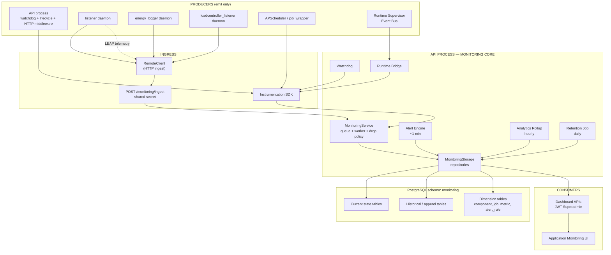

---

## 2A. Detailed flowcharts (read these in order)

This section is the primary visual guide. Each diagram is one complete story.

| Order | Flowchart | What you learn |
|------:|-----------|----------------|
| A | Big picture swimlane | Who talks to whom |
| B | Flag gate decision | What turns on when |
| C | API startup | Exact boot order |
| D | Heartbeat (API watchdog) | How `api` stays UP |
| E | Daemon heartbeat (remote ingest) | How listener/energy/LC report |
| F | Ingest request (HTTP) | Auth → parse → queue → DB |
| G | Pipeline worker + drop policy | What happens under load |
| H | LEAP connectivity + ping | Processor UP/DOWN path |
| I | HTTP metrics | Request → aggregate → flush |
| J | Job run instrumentation | Success / failure / stuck |
| K | Alert evaluate → open → ACK → resolve | Full alert lifecycle |
| L | Analytics + retention | Rollup and cleanup |
| M | Runtime crash → restart → UI | Child kill recovery |
| N | Superadmin UI read path | Screen → APIs → tables |
| O | Master OFF isolation | Monitoring 503, LMS still up |

---

### A. Big-picture swimlane (all actors)

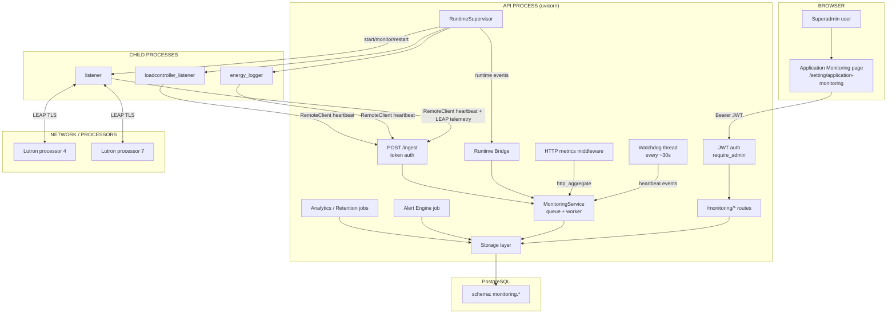

**Read tip:** Left/top = humans & UI. Center = API brain. Right/bottom = daemons, processors, DB.

---

### B. Feature-flag decision tree

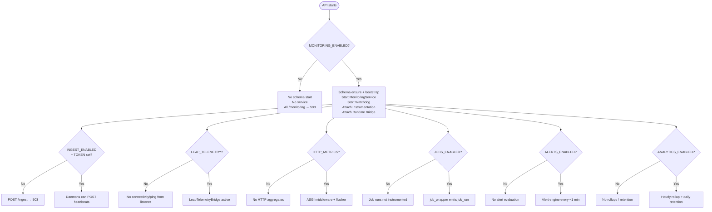

---

### C. API startup flowchart (detailed)

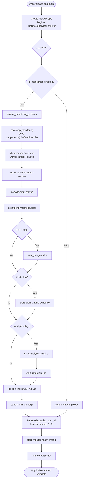

---

### D. Heartbeat flow — API Watchdog (in-process)

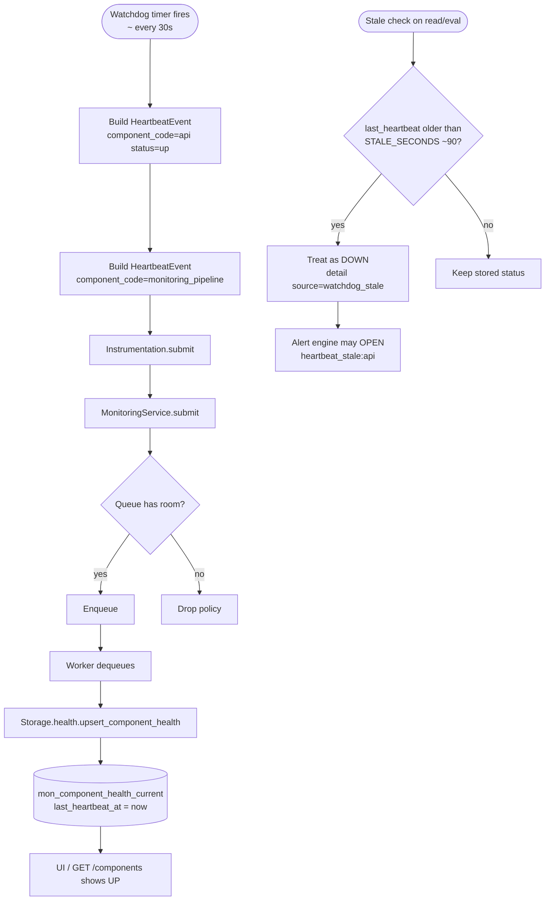

---

### E. Daemon heartbeat flow — remote ingest

```mermaid
sequenceDiagram
  autonumber
  participant D as Daemon<br/>(listener / energy / LC)
  participant RC as RemoteClient
  participant API as POST /monitoring/ingest
  participant AUTH as Ingest token check
  participant SVC as MonitoringService
  participant DB as mon_component_health_current

  loop Every heartbeat interval
    D->>RC: emit heartbeat(component_code, status=up)
    RC->>RC: retries + backoff on failure
    RC->>API: HTTP POST + X-Monitoring-Ingest-Token
    API->>AUTH: compare_digest(token)
    alt bad/missing token
      AUTH-->>RC: 401
      Note over D: LMS work continues; only warn log
    else ingest disabled / monitoring off
      AUTH-->>RC: 503
    else OK
      AUTH->>SVC: submit HeartbeatEvent
      SVC->>DB: upsert health
      DB-->>D: accepted 200
    end
  end
```

**If this path breaks** (wrong token, ingest OFF, API down): component stops updating → after ~90s appears **DOWN** → `heartbeat_stale` alert.

---

### F. Ingest HTTP request — step by step

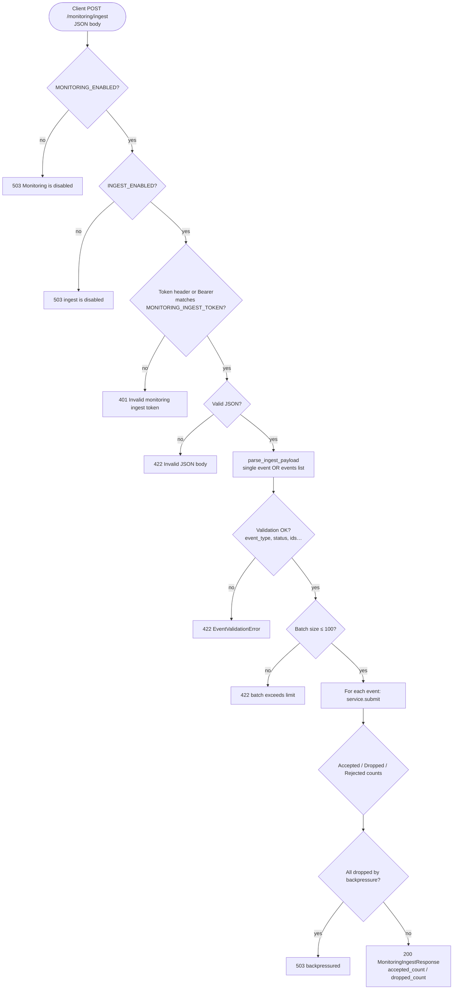

---

### G. Pipeline worker + drop policy (detailed)

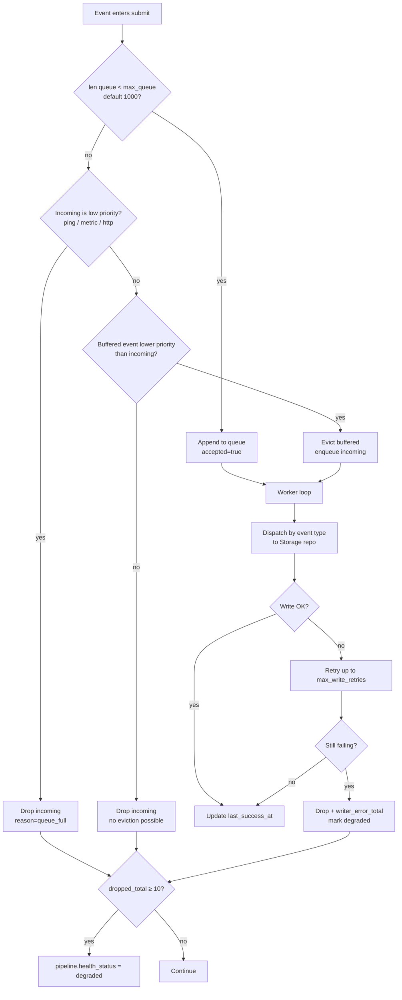

**Priority (keep high number last / drop first):**

| Priority | Events |
|--------:|--------|
| 0 highest | Lifecycle |
| 1 | Connectivity |
| 2 | Heartbeat, JobRun |
| 3 | HttpAggregate, Metric |
| 4 lowest | LeapPing |

---

### H. LEAP connectivity + ping flowchart

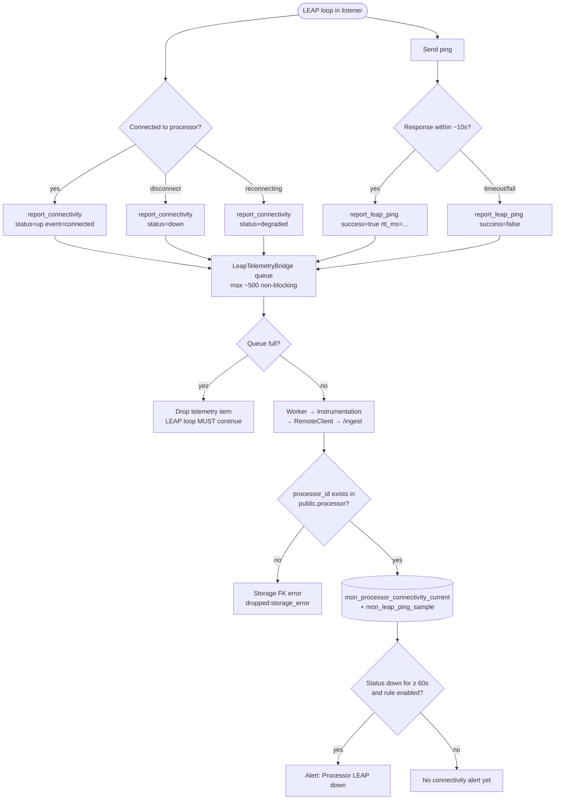

**Important:** Live LEAP “connected” events will overwrite a synthetic DOWN quickly. To test DOWN alerts, either cause a real outage or pause `MONITORING_LEAP_TELEMETRY` during the soak.

---

### I. HTTP metrics flowchart

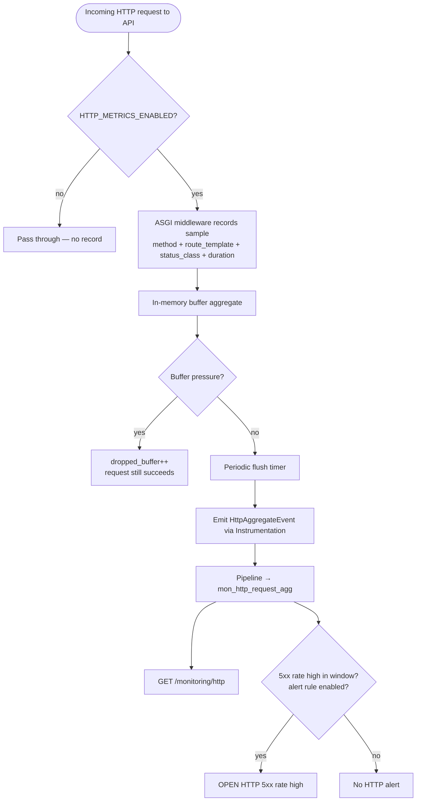

---

### J. Job instrumentation flowchart

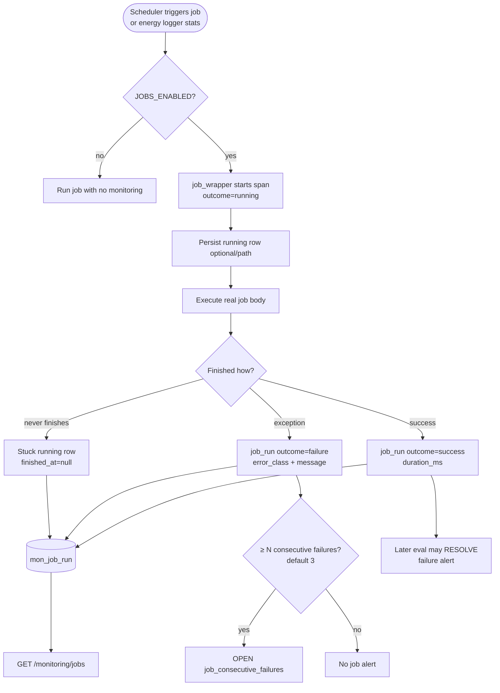

---

### K. Alert lifecycle flowchart (full)

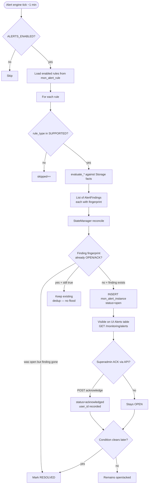

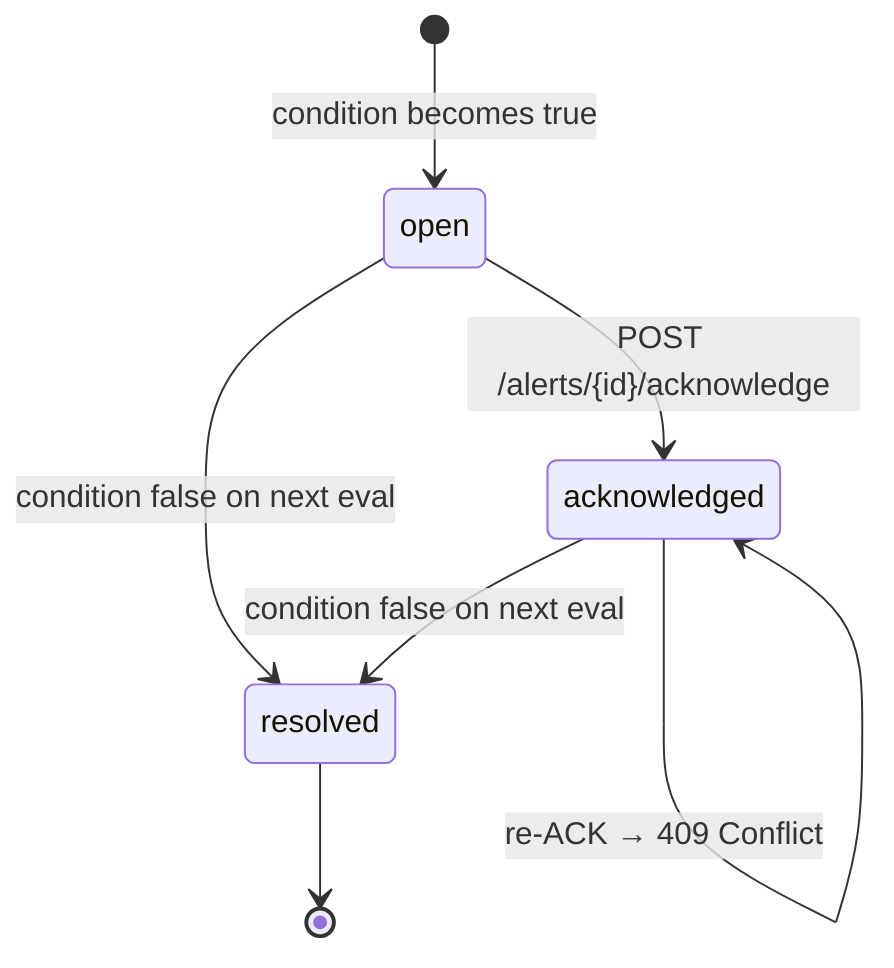

---

### L. Analytics + retention flowchart

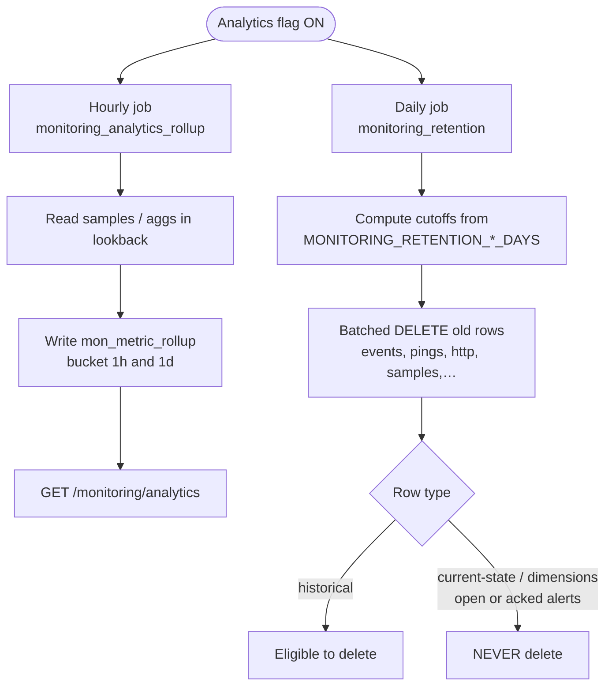

---

### M. Runtime child crash → recovery → monitoring

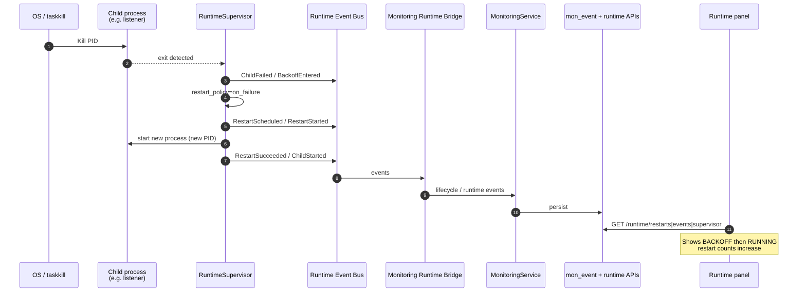

---

### N. Superadmin UI read path (screen map)

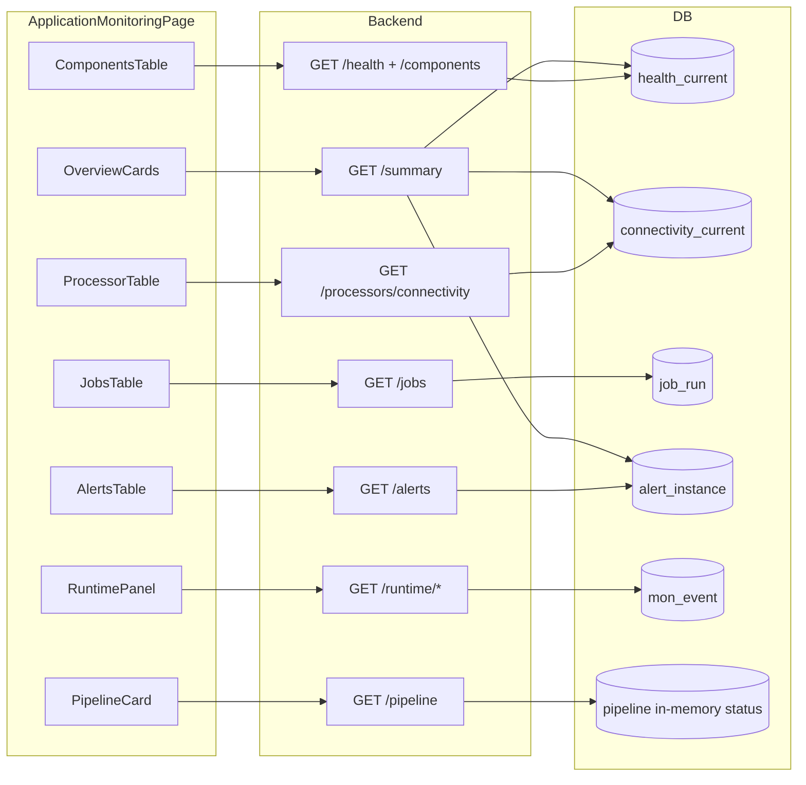

**Auto-refresh:** optional 30s `setInterval` → same GETs again.

---

### O. Master OFF isolation flowchart

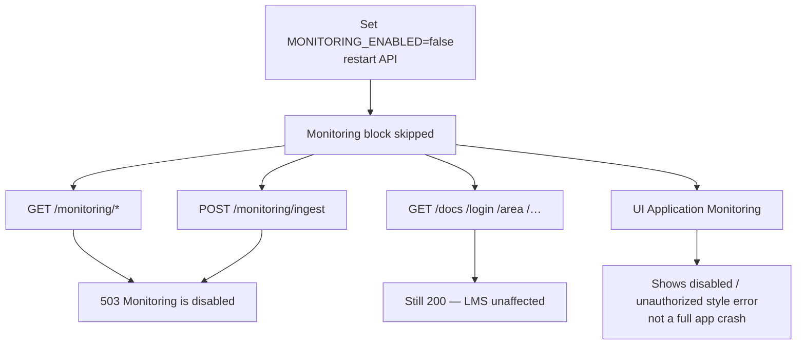

---

### P. One-page “follow a heartbeat” story

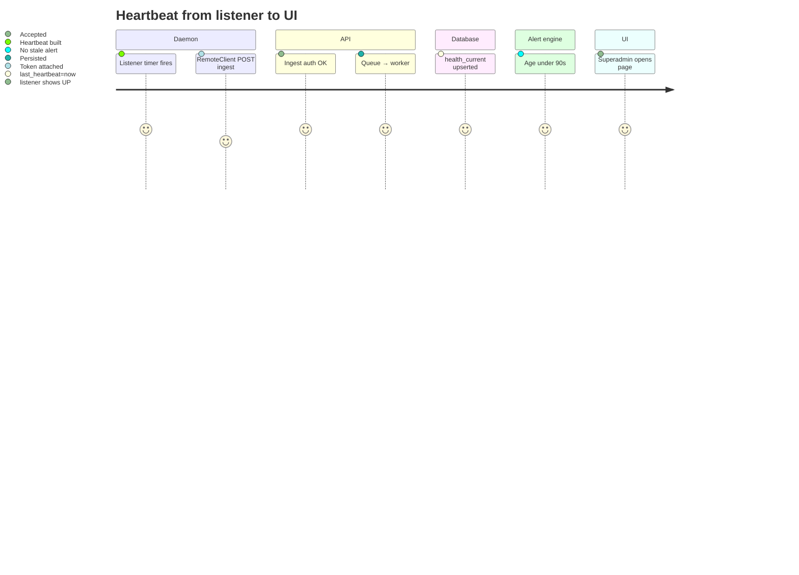

---

## 3. Layered ownership (who may write what)

| Role | Process / module | Allowed writes | Must not write |
|------|------------------|----------------|----------------|
| Producers | API, listener, energy_logger, LC, middleware, jobs | Emit events via Instrumentation / RemoteClient only | Direct SQL into monitoring tables |
| Monitoring Service | API process pipeline | Telemetry facts via Storage | Alert instance lifecycle (except as data) |
| Alert Engine | Scheduled job | `mon_alert_instance` only | Telemetry fact tables (except own `job_run`) |
| Analytics Engine | Scheduled job | `mon_metric_rollup` only | Current-state tables |
| Retention Job | Scheduled job | DELETE historical rows only | Current-state + dimension + open/acked alerts |
| Bootstrap | Startup / CLI | Dimension seeds | Runtime telemetry |
| Dashboard API | FastAPI routes | Alert **acknowledge** only | Ingest (separate auth) |
| Runtime Supervisor | API process | Child process lifecycle | Monitoring tables (bridge observes only) |

---

## 4. Feature flags (enable matrix)

All flags read from environment (`environment.env` / process env). Truthy values: `true` | `1` | `yes`.

| Flag | Default | Turns on |
|------|---------|----------|
| `MONITORING_ENABLED` | OFF | Schema ensure, bootstrap, service, watchdog, APIs, UI usability |
| `MONITORING_INGEST_ENABLED` | OFF | `POST /monitoring/ingest` acceptance |
| `MONITORING_INGEST_TOKEN` | unset | Shared secret for ingest auth |
| `MONITORING_INGEST_URL` | `http://127.0.0.1:8000/monitoring/ingest` | Daemon remote target |
| `MONITORING_LEAP_TELEMETRY` | OFF | Listener connectivity + ping bridge |
| `MONITORING_HTTP_METRICS_ENABLED` | OFF | HTTP ASGI middleware aggregates |
| `MONITORING_JOBS_ENABLED` | OFF | Job wrapper instrumentation |
| `MONITORING_ALERTS_ENABLED` | OFF | Alert engine schedule (~1 min) |
| `MONITORING_ANALYTICS_ENABLED` | OFF | Hourly rollups + daily retention |

### Important related knobs

| Env | Meaning | Typical default |
|-----|---------|-----------------|
| `MONITORING_HEARTBEAT_INTERVAL_SECONDS` | Watchdog emit interval | 30 |
| `MONITORING_HEARTBEAT_STALE_SECONDS` | Stale heartbeat threshold | 90 |
| `MONITORING_ALERT_EVAL_INTERVAL_SECONDS` | Alert engine cadence | 60 |
| `MONITORING_RETENTION_*_DAYS` | Per-table retention windows | see Runbook |

---

## 5. Startup sequence (API process)

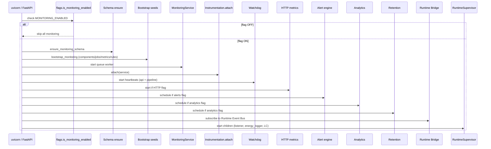

### Startup log signals (healthy)

| Log line | Meaning |
|----------|---------|
| `Monitoring bootstrap OK (components=…)` | Seeds applied |
| `Monitoring Self-Check] OK {…}` | Worker, watchdog, indexes OK |
| `Monitoring service and watchdog started` | Core pipeline live |
| `Monitoring runtime bridge attached` | Runtime events observed |
| `Monitoring HTTP metrics started` | HTTP flag on |
| `Monitoring alert engine scheduled` | Alerts flag on |

---

## 6. End-to-end data flows

### 6.1 In-process path (API producers)

```
Producer (watchdog / lifecycle / HTTP flush / job_wrapper / bridge)
    → Instrumentation.build_* + submit
    → MonitoringService.queue
    → Worker (single-writer)
    → DropPolicy (if full / write fail)
    → MonitoringStorage.*
    → monitoring.* tables
```

### 6.2 Remote daemon path

```
listener / energy_logger / loadcontroller_listener
    → Instrumentation (local) OR daemon heartbeat helper
    → RemoteClient (timeouts, retries, backoff)
    → POST /monitoring/ingest
         Auth: X-Monitoring-Ingest-Token  OR  Authorization: Bearer <ingest-token>
    → parse_ingest_payload → MonitoringService.submit
    → same pipeline as 6.1
```

### 6.3 LEAP connectivity / ping path

```
LEAP asyncio loop (listener)
    → LeapTelemetryBridge.report_connectivity / report_leap_ping  (non-blocking queue)
    → Instrumentation
    → RemoteClient → /monitoring/ingest   (when remote)
    → Storage:
         mon_processor_connectivity_current
         mon_leap_ping_sample
         mon_event
```

**Constraint:** `processor_id` must exist in LMS `processor` table (FK). Fake IDs are accepted into the queue then **dropped** on write (`storage_error`).

### 6.4 Read / UI path

```
Superadmin browser
    → Settings → Application Monitoring
    → monitoringApi.js (axios JWT)
    → GET /monitoring/summary|pipeline|components|processors|jobs|alerts|runtime/*
    → dashboard_read_models / api_read_models
    → Storage reads
```

---

## 7. Event types (ingest / instrumentation contract)

| `event_type` | Purpose | Key fields | Primary tables |
|--------------|---------|------------|----------------|
| `heartbeat` | Component liveness | `component_code`, `status`, `observed_at` | `mon_component_health_current` |
| `connectivity` | Processor LEAP link state | `processor_id`, `status`, `observer_component_code` | `mon_processor_connectivity_current`, `mon_event` |
| `leap_ping` | Ping sample | `processor_id`, `success`, `rtt_ms` | `mon_leap_ping_sample` |
| `job_run` | Job execution span | `job_key`, `outcome`, `started_at`, `finished_at` | `mon_job_run` |
| `http_aggregate` | Route-template HTTP bucket | `route_template`, `method`, `status_class`, counts | `mon_http_request_agg` |
| `metric` | Numeric sample | `metric_key`, `value`, `sampled_at` | `mon_metric_sample` |
| `lifecycle` | Start/stop/info events | `component_code`, `lifecycle_event_type`, `fingerprint` | `mon_event` |

### Allowed heartbeat statuses

`up` | `degraded` | `down` | `unknown` | `starting` | `stopping`

### Allowed job outcomes

Includes terminal and non-terminal: e.g. `success`, `failure`, `running`, …

### Ingest body shapes

| Shape | Example |
|-------|---------|
| Single event | `{ "event_type": "heartbeat", "component_code": "listener", "status": "up" }` |
| Batch | `{ "events": [ {...}, {...} ] }` max **100** events |

---

## 8. Pipeline, backpressure, and drop policy

| Concept | Behavior |
|---------|----------|
| Queue | Bounded (default `max_queue=1000`) |
| Worker | Single-writer drain loop |
| Low priority (drop first) | `LeapPingEvent`, `MetricSampleEvent`, `HttpAggregateEvent` |
| High priority (keep) | `LifecycleEvent`, `ConnectivityEvent`, `HeartbeatEvent`, `JobRunEvent` |
| When full | Drop incoming low-priority **or** evict lower-priority buffered event |
| Write failures | Retry (max 2) then drop + `writer_error_total` |
| Degraded | After enough drops (`degrade_after_drops`, default 10) → pipeline `degraded=true` |
| API signal | If entire batch dropped → HTTP **503** backpressure |

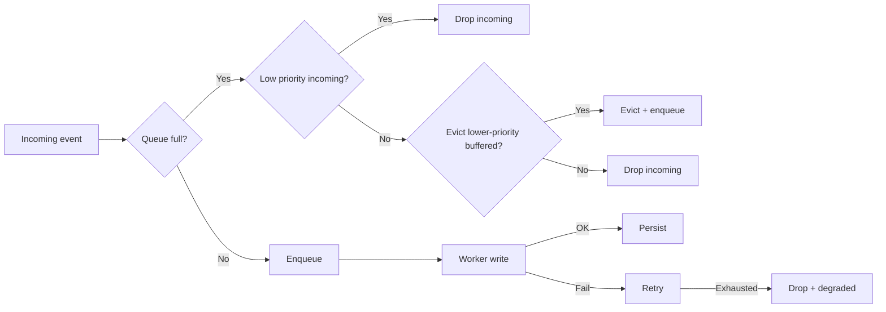

---

## 9. Components (seeded registry)

| Code | Kind | Heartbeat producer |
|------|------|--------------------|
| `api` | process | API Watchdog |
| `monitoring_pipeline` | process | API Watchdog |
| `listener` | process | Daemon remote heartbeat (+ LEAP path) |
| `energy_logger` | process | Daemon remote heartbeat |
| `loadcontroller_listener` | process | Daemon remote heartbeat |
| `scheduler` | process | None dedicated (often appears stale) |
| `alert_engine` | process | None dedicated (job runs only) |
| `analytics_engine` | process | None dedicated (job runs only) |
| `database` | dependency | None dedicated |
| `certificates` | dependency | None dedicated |

**Stale rule:** If stored status is `up`/`degraded`/`starting` but `last_heartbeat_at` older than threshold → treat as **down** (`watchdog_stale`).

---

## 10. Alert engine

### 10.1 Lifecycle

```
Condition true  → OPEN (dedup by rule_id + fingerprint)
Operator action → ACKNOWLEDGED  (POST /monitoring/alerts/{id}/acknowledge)
Condition false → RESOLVED
```

### 10.2 Supported rule types (evaluated)

| Rule type | Seed code | Typical trigger |
|-----------|-----------|-----------------|
| `heartbeat_stale` | `component_heartbeat_stale` | Heartbeat age ≥ `stale_seconds` (default 90) |
| `connectivity_down` | `processor_leap_down` | Status `down` for ≥ `min_down_seconds` (default 60) |
| `job_failures` | `job_consecutive_failures` | N consecutive failures (default 3) |
| `http_error_rate` | `http_5xx_rate` | 5xx rate > threshold in window |
| `metric_threshold` | `db_pool_pressure` | Metric / ratio exceeds threshold |

### 10.3 Seeded but NOT evaluated in engine (always skipped)

| Seed code | Rule type | Note |
|-----------|-----------|------|
| `ping_success_rate_low` | `ping_success_rate` | Not in `SUPPORTED_RULE_TYPES` |
| `pipeline_degraded` | `component_status` | Not in `SUPPORTED_RULE_TYPES` |
| `runtime_foreign_mutex` | `runtime_event` | Handled partly via runtime bridge path, not generic evaluator |

### 10.4 Enablement checklist (alerts actually open)

1. `MONITORING_ENABLED=true`
2. `MONITORING_ALERTS_ENABLED=true`
3. Row in `monitoring.mon_alert_rule` has `enabled=true` (seeds default **false**)
4. Telemetry facts present (stale HB, down connectivity, failures, …)
5. Engine job running (`monitoring_alert_engine`)

---

## 11. Analytics and retention

| Job | Schedule | Flag | Writes / deletes |
|-----|----------|------|------------------|
| `monitoring_analytics_rollup` | Hourly (~`:05` UTC) | `MONITORING_ANALYTICS_ENABLED` | `mon_metric_rollup` (`1h` / `1d`) |
| `monitoring_retention` | Daily (~03:30) | same | Batched DELETE of old historical rows |

### Never deleted by retention

| Kept forever (by policy) |
|--------------------------|
| `mon_component_health_current` |
| `mon_processor_connectivity_current` |
| Dimension tables (`mon_component`, definitions, `mon_alert_rule`) |
| Open / acknowledged alert instances |

---

## 12. HTTP APIs

### Auth model

| Endpoint class | Auth |
|----------------|------|
| Dashboard / health / runtime GETs | LMS JWT + Superadmin (`require_admin`) |
| `POST /monitoring/ingest` | Ingest shared secret (**not** LMS JWT) |
| Master flag off | **503** `{ "detail": "Monitoring is disabled" }` |

### Endpoint map

| Method | Path | Purpose |
|--------|------|---------|
| GET | `/monitoring/health` | Registry + health board + pipeline snapshot |
| GET | `/monitoring/summary` | Dashboard KPIs |
| GET | `/monitoring/components` | Per-component current health |
| GET | `/monitoring/processors` | Connectivity map (dashboard shape) |
| GET | `/monitoring/processors/connectivity` | Connectivity map (phase-5 shape) |
| GET | `/monitoring/pipeline` | Queue / worker / drop counters |
| GET | `/monitoring/jobs` | Job definitions + recent runs |
| GET | `/monitoring/http` | HTTP aggregates (+ related rollups) |
| GET | `/monitoring/analytics` | Metric rollups (`bucket_size=1h\|1d`) |
| GET | `/monitoring/alerts` | Paginated alerts (`status`, `severity`, …) |
| POST | `/monitoring/alerts/{id}/acknowledge` | Acknowledge open alert |
| POST | `/monitoring/ingest` | Daemon / synthetic event ingest |
| GET | `/monitoring/runtime/supervisor` | Live supervisor + bridge stats |
| GET | `/monitoring/runtime/events` | Runtime lifecycle events |
| GET | `/monitoring/runtime/restarts` | Restart history |
| GET | `/monitoring/runtime/abandoned` | Abandoned child events |
| GET | `/monitoring/runtime/restart-counts` | Aggregated restart counts |

### Routing note

Dashboard router is mounted **before** Phase-5 router. For overlapping paths (`/jobs`, `/pipeline`), **dashboard handlers win**.

---

## 13. Frontend UI

| Item | Location |
|------|----------|
| Page | `lutron_frontend/src/shared/monitoring/ApplicationMonitoringPage.jsx` |
| API client | `.../shared/monitoring/monitoringApi.js` |
| Route | `/setting/application-monitoring` |
| Access | Superadmin only |
| Refresh | Manual + optional auto-refresh 30s |

### UI sections vs APIs

| UI section | API(s) |
|------------|--------|
| Overview | `/monitoring/summary` |
| Pipeline | `/monitoring/pipeline` |
| System Components | `/monitoring/health` + `/monitoring/components` |
| Processor Connectivity | `/monitoring/processors/connectivity` |
| Background Jobs | `/monitoring/jobs` |
| Alerts | `/monitoring/alerts` (read-only in UI) |
| Runtime Recovery | `/monitoring/runtime/*` |

### UI gaps vs backend

| Backend exists | UI today |
|----------------|----------|
| `/monitoring/http` | No dedicated panel |
| `/monitoring/analytics` | No dedicated panel |
| Alert acknowledge POST | Not wired in UI (API-only) |

---

## 14. Runtime Recovery bridge

```mermaid
flowchart LR
  RS[RuntimeSupervisor] --> EB[Event Bus]
  EB --> BR[Runtime Bridge subscriber]
  BR --> MAP[Map to lifecycle / alert findings]
  MAP --> MS[MonitoringService]
  MAP --> AL[Optional open alert by fingerprint]
  MS --> EV[mon_event]
```

| Runtime event examples | Monitoring effect |
|------------------------|-------------------|
| ChildFailed / RestartStarted / RestartSucceeded | Persisted runtime events; restart counts |
| Foreign mutex / abandoned | Surfaced in runtime APIs / panel |

**Ownership:** Supervisor **restarts** children. Monitoring only **observes** and records.

---

## 15. Database schema (conceptual)

### Current-state (latest only)

| Table | Contents |
|-------|----------|
| `mon_component_health_current` | Latest heartbeat per component |
| `mon_processor_connectivity_current` | Latest LEAP connectivity per processor |

### Historical / append

| Table | Contents |
|-------|----------|
| `mon_event` | Lifecycle / connectivity / generic events |
| `mon_leap_ping_sample` | Ping RTT samples |
| `mon_job_run` | Job execution rows |
| `mon_http_request_agg` | HTTP bucket aggregates |
| `mon_metric_sample` | Raw metric samples |
| `mon_metric_rollup` | Hour/day rollups |
| `mon_alert_instance` | Alert OPEN/ACK/RESOLVED instances |

### Dimensions (seeded)

| Table | Contents |
|-------|----------|
| `mon_component` | Component registry |
| `mon_job_definition` | Job catalog |
| `mon_metric_definition` | Metric catalog |
| `mon_alert_rule` | Alert rule definitions |

---

## 16. Key code map (for navigators)

| Area | Path |
|------|------|
| Flags | `app/monitoring/flags.py` |
| Service / queue | `app/monitoring/service.py` |
| Drop policy | `app/monitoring/drop_policy.py` |
| Events | `app/monitoring/events.py` |
| Ingest parse | `app/monitoring/ingest.py` |
| Instrumentation | `app/monitoring/instrumentation.py` |
| Remote daemon client | `app/monitoring/remote_client.py` |
| Watchdog | `app/monitoring/watchdog.py` |
| LEAP bridge | `app/monitoring/leap_telemetry.py` |
| HTTP metrics | `app/monitoring/http_metrics.py` |
| Job wrapper | `app/monitoring/job_wrapper.py` |
| Alerts | `app/monitoring/alerts/` |
| Analytics | `app/monitoring/analytics/` |
| Retention | `app/monitoring/retention_job.py` |
| Runtime bridge | `app/monitoring/runtime_bridge/` |
| Storage | `app/monitoring/storage/` |
| Seeds | `app/monitoring/seeds.py` |
| API routes | `app/api/routes/monitoring.py`, `monitoring_dashboard.py` |
| Startup wiring | `app/main.py` lifespan |
| UI | `lutron_frontend/src/shared/monitoring/` |

---

## 17. Failure modes → what you should see

| Production failure | Expected monitoring signal |
|--------------------|----------------------------|
| API process down | No heartbeats; APIs unreachable |
| Watchdog stale | `api` / pipeline → down; `heartbeat_stale` alert |
| Daemon crash | Runtime restart events; brief DOWN then UP if supervisor recovers |
| Daemon cannot ingest (token/URL/flag) | Component heartbeats go stale → down + alert |
| Processor offline ≥ 60s | Connectivity `down` + `processor_leap_down` |
| Jobs failing repeatedly | `job_consecutive_failures` |
| HTTP 5xx spike | `http_5xx_rate` |
| Ingest flood | Pipeline `degraded`, drop counters |
| Monitoring master off | All `/monitoring/*` → 503; LMS routes still work |
| Invalid ingest | 401 (auth) / 422 (validation) |

---

## 18. Security summary

| Surface | Control |
|---------|---------|
| Dashboard reads / ACK | Superadmin JWT |
| Ingest | Shared secret header/Bearer; **JWT must not** be accepted as ingest token |
| HTTP aggregates | Route **templates** only; no raw IDs/secrets in buckets |
| Emit path | Failures swallowed / degraded — LMS business continues |

---

## 19. Full happy-path story (one narrative)

1. Operator sets `MONITORING_ENABLED=true` (+ child flags as needed) and restarts API.  
2. Schema + bootstrap seed components/jobs/metrics/rules.  
3. `MonitoringService` + Watchdog start; `api` and `monitoring_pipeline` heartbeats begin.  
4. Daemons start under Runtime Supervisor; with ingest enabled they POST heartbeats.  
5. Listener (LEAP telemetry on) reports processor connectivity/ping.  
6. HTTP middleware (if on) flushes aggregates; jobs (if on) record runs.  
7. Alert engine (if on + rules enabled) opens/resolves instances.  
8. Analytics/retention (if on) roll up and prune history.  
9. Superadmin opens **Settings → Application Monitoring** and sees Overview / Pipeline / Components / Processors / Jobs / Alerts / Runtime.  

---

## 20. Glossary

| Term | Meaning |
|------|---------|
| Producer | Code that emits monitoring events |
| Instrumentation | Only allowed SDK for producers to emit |
| Ingest | HTTP entry for remote/synthetic events |
| Pipeline | In-API queue + worker that persists events |
| Drop policy | Priority rules under backpressure |
| Registry | In-memory map of seeded components/jobs/metrics/rules |
| Current-state table | Latest row per entity (not append-only) |
| Fingerprint | Dedup key for alerts / lifecycle |
| Runtime Bridge | Observer from Runtime Event Bus into Monitoring |
| Domain Alerts | Separate product feature under `/alert` (devices/lighting) — **not** this platform |

---

## 21. Related docs

| Doc | Use when |
|-----|----------|
| `docs/MONITORING_API_REFERENCE.md` | Exact request/response shapes |
| `docs/monitoring/OPERATIONS.md` | Day-2 ops |
| `docs/monitoring/RUNBOOK.md` | Enable rules, retention, ACK |
| `docs/monitoring/TROUBLESHOOTING.md` | 503 / 401 / no alerts / drops |
| `docs/MONITORING_RUNTIME_BRIDGE.md` | Runtime bridge details |

---

## 22. Converter notes (for MD → DOC/PDF tools)

- Prefer rendering **Mermaid** blocks as diagrams (flowchart, sequenceDiagram, stateDiagram, journey).  
- **§2A** is intentionally diagram-heavy — render every fenced `mermaid` block; do not drop them.  
- Keep **tables** as tables (do not flatten to paragraphs).  
- Section numbering is intentional for cross-reference.  
- Code paths are repository-relative from `lutron_backend/` unless noted.  
- Flags and defaults may change; treat env matrix in §4 as the operational source of truth at deploy time.  
- Suggested doc outline for PDF: Title → §1 → §2 → **§2A (all charts)** → §3 onward.
